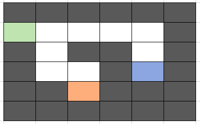
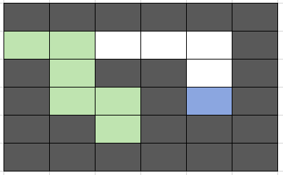
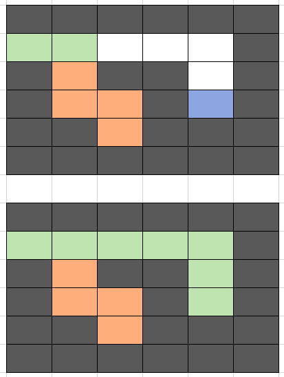
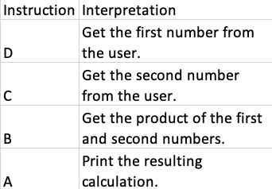

# **The Stack**

## <a name="intro"></a>Introduction
* [Welcome](welcome.md)
* **Stacks**
  * [Introduction](#intro)
  * [Using the Stack](#uses)
  * [Performance](#performance)
  * **Code:** [Problems](01-stack.py) | [Answers](examples/01-example.py)
* [Linked Lists](02-linkedlist.md)
* [Trees](03-tree.md)

### ***What is a stack?***
A stack is at the very basis of how a program *thinks*. When you send your program a set of instructions, it will work through that set from the top down. If you tell the program to do something else before it's gone through everything else, then it will handle whatever is on top of its instruction list first, working its way down the stack.

### ***Visualizing a Stack***
Imagine this. You sit down for breakfast to enjoy a nice breakfast, and you have a big plate of pancakes in front of you. Looks good, right? Well, if you want the freshest pancake, you'll reach for the one on top. And so will everyone else sitting at the table, taking a pancake one by one from the top until there are no more. 

If you'd like a more code-like example, then you're in luck! Lists in Python provide us with an excellent demonstration of how the stack works. Let's initialize our stack as a list and add a few instructions to it. Feel free to follow along in [this sample code](01-stack.py)!
```python
stack = list()
stack.append("A")
stack.append("B")
stack.append("C")
```
So now, we have a stack that looks like this:
```
['A', 'B', 'C']
```
Now that we have our stack with some instructions, let's take a look at what's at the end of the stack and handle it. 
```python
instruction = stack.pop()
print(instruction)
```
Running this code will display the following in our terminal:
```
C
```
Let's say that the computer recieves a new instruction after it handles C. 
```python
stack.append("D")
```
Right now, our stack looks something like this:
```
['A', 'B', 'D']
```
While we might see A as being in the "front", A is actually at the bottom of our stack right now. Retrieving the rest of our stack using the .pop() method as above will return the most recently added item, returning D, then B, then A. 

## <a name="uses"></a> Using the Stack


### ***Keeping organized***
Wait, but how does only handling what was *just* given to you keep you organized? Won’t you forget about everything at the start?

Well, not quite. As we'll discuss in the section regarding **Trees**, operating off of the stack helps your program see how many layers deep it is. I'll illustrate a brief bit of this concept now, to help you see just how useful the stack is. 

### **Examples**

**THE MAZE**: Let's imagine that we have a chunk of code that tries to walk through a maze. Such a code can actually be written using concepts that we'll learn about later on, but this perfectly illustrates the usage of a stack. Starting off, we'll have our maze look like this:



We start off in that little green tile on the left, and want to make it to the blue tile on the right. However, we accidentally made a wrong turn. Let's look at our stack.
```python
stack.append("right")
stack.append("down") # This is where we accidentally make a wrong turn...
stack.append("down")
stack.append("right")
stack.append("down")
```
    Instructions: ['right', 'down', 'down', 'right', 'down']

This sequence of turns will put us in this situation:



Now we're stuck in a dead end! Do we have to start over? No, we can just *undo* whatever actions put us there. Our code will then pop the last few instructions from the stack and proceed as normal, until it gets to the blue tile. 
```python
stack.pop()
stack.pop()
stack.pop()
stack.pop()
```
    Instructions: ['right']



After getting back to a safe point, the program will continue running until it reaches the end, the blue square.

```python
stack.append("right")
stack.append("right")
stack.append("right")
stack.append("down")
stack.append("down")
```
    Instructions: ['right', 'right', 'right', 'right', 'down', 'down']

**THE CALCULATOR**: Supplied in the [sample code](01-stack.py) is a sample problem that you'll get to work through now. You're given a pre-set stack of instructions that your code must look at and interpret, according to this table below.



Your terminal should look something like this:

    1st Number: 3
    2nd Number: 4
    Product: 12

[This key](examples/01-example.py) has the solution to this example. Give it a try before looking through it!

**THE OPERATING STACK**: Now, let's look at another stack problem, one that you'll solve to see if you've got the stack down! Given in the sample code above is a series of functions that will need to be called inside of each other in order to get a specific output. Your terminal will look like the following:

    Function A
    Function D
    Function B
    Function C
    Function E

If you look, there's a bit of a hint at the bottom. We call functionE() first, what could that mean...?

## <a name="performance"></a> Performance

Now that we've seen some examples of what a stack can do, lets talk about some finer details. One of the benefits of working using the stack is that it is *extremely* fast to pull something right off of the end of the stack. Thinking back to the pancake analogy, you simply reach out and grab whatever is on the top. Since you aren't rooting around the whole plate to get a single specific pancake, it doesn't matter how big the stack of pancakes is. Taking one pancake from the end is all you have to do. 

### **Big O Notation**

In programming, there's something called "Big O Notation". Essentially, it's a way to quantify or measure how efficient a program is at performing its duties. 

If something is done in O(1) time, that means that when this program is called, it will do it in one unit of time. If something is done in O(n) time, that means that every increae in n will result in a linear increase in the time it takes to complete the task. N, in this case, represents the number of items that the program has to sort through. 

In the case of the stack, pushing or popping something onto or off of the back of the stack will only take one unit of time, since it only touches one item--the most recent entry into the stack. Since you aren't taking anything from the bottom of the stack, nothing you do to the top will affect anything below it, making operations on a stack pass quickly. This means that popping and pushing occurs in O(1) time. 

If you were to write a function to return the names of each item in the stack, then that would be O(n) time, since if there are 'n' items in a stack, then the function would have to go through every item in the stack.

**<< Prev** | [Home](welcome.md) | [Next >>](02-linkedlist.md)
