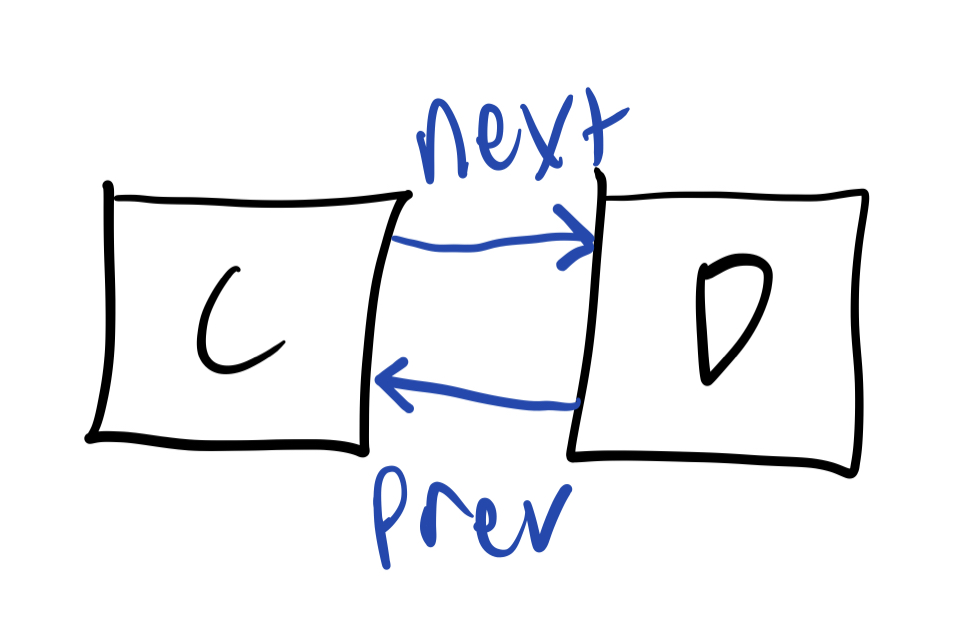

# **Linked Lists**

## <a name="intro"></a>Introduction
* [Welcome](welcome.md)
* [Stacks](01-stack.md)
* **Linked Lists**
  * [Introduction](#intro)
  * [Nodes](#nodes)
  * [Examples](#examples)
  * [Performance](#performance)
* [Trees](03-tree.md)


### ***What is a linked list?***
A linked list is, in essence, a collection of points (or "nodes") tied together through a series of references. We thought about pancakes in the last module, so now let's think about *trains*. A train is a collection of cars, connected to one another. The train engine, or the front car, has nothing in front of it, but has a car attached behind it. The car behind it is connected to the engine in front and another car directly behind it. The car behind it is connected in a similar fashion, up until it gets to the final car, which is only connected to the car in front of it. Let's look at some pictures to help us visualize it. 


See? We have the main car in the front, and a few cars behind it. The engine has nothing in front of it, but has a car attached behind it. The second car, the one behind it, has the engine in front of it and another car behind it. Here's another picture to help illustrate the point.


See how each car on the train is only connected to the one directly in front of or behind it? If we were to disconnect one, then the whole train would fall apart. Right? We'll get to that, but let's talk about something that I've been hinting at this whole time--nodes.

## <a name="nodes"></a>Nodes
### ***What is a node?***
Earlier, I mentioned "data points" and "train cars". Well, what I was actually talking about was the node! A linked list is a series of nodes tied to each other through a series of references. Just like the train, each node knows the node that is directly in front of it and directly behind it. Here's the train picture, but in node form!


Node A is known as the head. Since it's the first in line, there's nothing in front of it, or nothing previously. Traveling down the list, we see that the next node is B, and so on and so forth. 

### ***Moving from one node to another***
In the picture above, you might have noticed that we labled the lines "next" and "previous". Those are the names for the references. Let's say we start at A. How do we get to node B? Well, we just call A.next and that will point us to B. If we want to look at node C, then we call B.next and we'll be there. If we want to go back a level to B, then we can call C.prev and that will put us back to B. Let's work through an example. 

### ***Example: Climbing the Ladder***
[Here's the code](02-linkedlist.py) for the first example we'll work through. Here, we have 6 nodes without any references, so they're six train cars without any latches between them. It's your job to go through and manually attach each node to one another. Yes, it's tedious, but it will help you! Here's what your terminal should look like when you've done it correctly:

    Node: A Next: B Prev: None
    Node: B Next: C Prev: A
    Node: C Next: D Prev: B
    Node: D Next: E Prev: C
    Node: E Next: F Prev: D
    Node: F Next: None Prev: E
 And [here's the key](examples/02-example.py) if you'd like to check your work. 


### ***How does that work?***
Ok. Now that we have the logic down for connecting nodes, we can dive into working on linked lists. We'll use the same logic for our second example, but this time you'll be writing a function for inserting things in between two values. Sounds fun, right? Let's look at the logic. 

Let's look at the example code you just wrote. Suppose you have node C and node D, and you want to insert node Z inbetween them. How would you do that? Well, we would want to change the references to include Z, without dropping anything else. I've cut off the rest of the nodes just for the sake of simplicity in this image.



In order to connect Z in here, we need to tie it to both C and D. We can do that by setting Z.next to D, and then setting C.next to Z. If we try to set C.next first, then there'd be no easy way to point Z.next to D! In code form, we could write the following:

```python
Z.next = D
C.next = Z
```


In similar fashion, we can set the prev references just like the next reference, only backwards!

```python
Z.prev = C
D.prev = Z
```


With this complete, we now have the tools to completely write a function to do all of this automatically. Yes! Let's use the skills we learned in the last example to complete our next task.


## <a name="examples"></a> Example: Between the Nodes

[In the same code](02-linkedlist.py) as above, we have our second example. Much like the example above, we're going to write a function to add a node (Z) in between two nodes that are already tied together (C & D). It's pretty self explanatory, so head on over and check it out!

[Here's the key](examples/02-example.py) for when you think you've got it, or when you get stumped. But don't give in too easily!

## <a name="performance"></a> Performance

Like we saw above, when we want to insert a new value into a linked list, our performance depends both on how close to the start we want to add the new value and hiw many items are inside the list. In the worst case scenario, we'd need to iterate through every single item in the linked list, so this would give us O(n) performance. Other operations, like adding a new head or tail to a linked list, is done in O(1) time, since we only have to touch one piece of data.