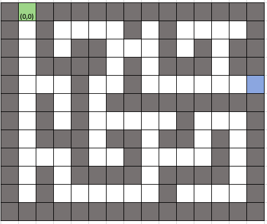

# **Trees**

## <a name="intro"></a>Introduction
* [Welcome](welcome.md)
* [Stacks](01-stack.md)
* [Linked Lists](02-linkedlist.md)
* **Trees**
  * [Introduction](#intro)
  * [Recursion](#nodes)
  * [Binary Search Trees](#bst)
  * [Performance](#performance)

### ***What is a tree?***
Let's think back to the linked list. Each node in the list had a maximum of one node in the node.next position, and a maximum of one node in the node.prev position. Trees operate in much of the same manner! The main difference here is that a tree's node can have multiple different nodes in the node.next position. Let's take a look at a picture here. 


Behold the tree! Wait, no. Sorry. Wrong tree. 

Here's what the tree we want to talk about looks like. If you flip it upside down, can you see why we call it a tree?


What we might call the *trunk* of a real tree, we call the "root" in technical terms. The root is like the head from a linked list, but the difference is that a root can have multiple nodes directly connected to it. Root node A has two child nodes, node B and node C. Each of them form their own subtrees below them. When a node has nothing below it, it's called a leaf node. 


## Recursion
Before we go any further to discuss the uses of a tree, it would be beneficial to take a quick detour to talk about recursion. What *is* recursion?
### ***Recursion***
Recursion is the process of a function calling itself within itself. Let's look at some sample code.
Here, we define the function recursive_message_1, which takes some message that we give it and prints it. Then, it calls itself again. 
```python
def recursive_message_1(message):
    print(message)
    recursive_message_1(message)

recursive_message_1("hello")
```
It calls itself over and over again, until after printing "hello" close to 1000 times, Python kicks in and stops the process by returning the following:

    RecursionError: maximum recursion depth exceeded while calling a Python object

Let's try something else, then. We'll write a new function that takes another variable, *count*, and will run until the count hits zero. 
```python
def recursive_message_2(message, count):
    count -=1
    if count >= 0:
        print(f"{message} {count}")
        recursive_message_2(message, count)

recursive_message_2("hello", 5)
```
This function feeds the count back into itself after subtracting one. This code would give us this in our terminal:
    hello 4
    hello 3
    hello 2
    hello 1
    hello 0

Alright, now let's look at one more thing. Check out what happens when we print the message *after* the recursive call. 
```python
def recursive_message_3(message, count):
    count -=1
    if count >= 0:
        recursive_message_3(message, count)
        print(f"{message} {count}")

recursive_message_3("hello", 5)
```
    hello 0
    hello 1
    hello 2
    hello 3
    hello 4

Why does that work out? It prints them out in the opposite order--the last item is the first one out... Does that sound familiar? Remember our friend the stack! 

Let's analyze the code to see how the stack figures into this. The first time the function is called, it takes the count and subtracts one from it. Then, it checks if the count is greater than or equal to 0. If it is, the function calls itself again. It will do this until count is less than 0. When that happens, where are we? Well, we're at the top of the stack--it has now finished calling itself when count is equal to 0, and so it goes on to the next line where it prints out our message. It then goes back up a layer and then prints out the next message, and then the next. Impressive, right?

Remember when I said that we'd learn something that could solve that maze for us, from the first example? Well, now we have all the tools to do just that!

### Example: The Amazingly Recursive Maze



We'll be using a slightly more complicated maze here than in our stack example. [Here's the code](03-tree.py) that you'll be working through for this example. This maze is represented graphically here, but in Python, it's stored as a list (available [here](examples/maze.py) if you really want to see it). The function to test if a certain move is valid has already been completed, so all you have to do is create a recursive function that tests each possible direction. Can the position advance to the left? Can it move to the right? How about down? Remember what I said about stacks--that's key for this example! As always, [there's a key](examples/03-example.py) if you happen to get stuck, but make sure to give it an honest try before you head straight to it. Good luck!

## Binary Search Trees
### ***Moving Through a Tree with Recursion***


* Like a linked list, but each “parent” node can have multiple “children” nodes—butt they’re still part of the same branch. 
* An easy way to look at it is to look at an actual tree. Has one “root” (or stumps, but “stump” sounds less cool than “root”) that begins to branch off. Each new branch can have multiple smaller branches coming off of it, but each branch only has one main limb that it connects to.
## Tying everything together

* What does a tree have in common with linked lists? How is it different?
* How does a 
### ***Uses of a tree/working with trees***
* How does the concept of the stack help when working with trees?
* BST - Binary Search Trees

## Example: Searching through a binary search tree

## Performance