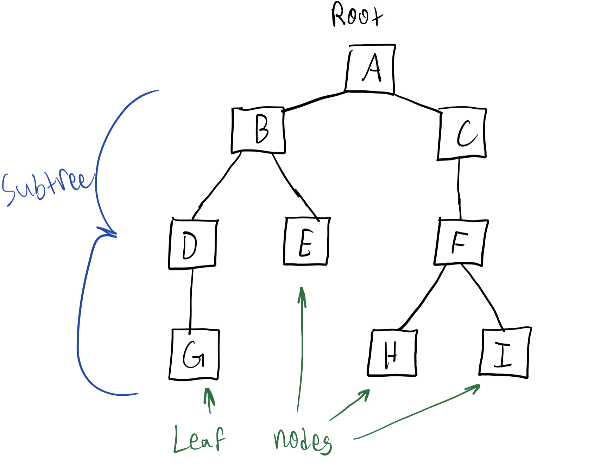

# **Trees**

## <a name="intro"></a>Introduction
* [Welcome](welcome.md)
* [Stacks](01-stack.md)
* [Linked Lists](02-linkedlist.md)
* **Trees**
  * [Introduction](#intro)
  * [Recursion](#nodes)
  * [Binary Search Trees](#bst)
  * [Performance](#performance)

### ***What is a tree?***
Let's think back to the linked list. Each node in the list had a maximum of one node in the node.next position, and a maximum of one node in the node.prev position. Trees operate in much of the same manner! The main difference here is that a tree's node can have multiple different nodes in the node.next position. Let's take a look at a picture here. 


Behold the tree! Wait, no. Sorry. Wrong tree. 

Here's what the tree we want to talk about looks like. If you flip it upside down, can you see why we call it a tree?



What we might call the *trunk* of a real tree, we call the "root" in technical terms. The root is like the head from a linked list, but the difference is that a root can have multiple nodes directly connected to it. Root node A has two child nodes, node B and node C. Each of them form their own subtrees below them. When a node has nothing below it, it's called a leaf node. 


## Recursion
Before we go any further to discuss the uses of a tree, it would be beneficial to take a quick detour to talk about recursion. What *is* recursion?
### ***Recursion***
Recursion is the process of a function calling itself within itself. Let's look at some sample code.
Here, we define the function recursive_message_1, which takes some message that we give it and prints it. Then, it calls itself again. 
```python
def recursive_message_1(message):
    print(message)
    recursive_message_1(message)

recursive_message_1("hello")
```
It calls itself over and over again, until after printing "hello" close to 1000 times, Python kicks in and stops the process by returning the following:

    RecursionError: maximum recursion depth exceeded while calling a Python object

Let's try something else, then. We'll write a new function that takes another variable, *count*, and will run until the count hits zero. 
```python
def recursive_message_2(message, count):
    count -=1
    if count >= 0:
        print(f"{message} {count}")
        recursive_message_2(message, count)

recursive_message_2("hello", 5)
```
This function feeds the count back into itself after subtracting one. This code would give us this in our terminal:
    hello 4
    hello 3
    hello 2
    hello 1
    hello 0

Alright, now let's look at one more thing. Check out what happens when we print the message *after* the recursive call. 
```python
def recursive_message_3(message, count):
    count -=1
    if count >= 0:
        recursive_message_3(message, count)
        print(f"{message} {count}")

recursive_message_3("hello", 5)
```
    hello 0
    hello 1
    hello 2
    hello 3
    hello 4

Why does that work out? It prints them out in the opposite order--the last item is the first one out... Does that sound familiar? Remember our friend the stack! 

Let's analyze the code to see how the stack figures into this. The first time the function is called, it takes the count and subtracts one from it. Then, it checks if the count is greater than or equal to 0. If it is, the function calls itself again. It will do this until count is less than 0. When that happens, where are we? Well, we're at the top of the stack--it has now finished calling itself when count is equal to 0, and so it goes on to the next line where it prints out our message. It then goes back up a layer and then prints out the next message, and then the next. Impressive, right?

Remember when I said that we'd learn something that could solve that maze for us, from the first example? Well, now we have all the tools to do just that!

### Example: The Amazingly Recursive Maze


We'll be using a slightly more complicated maze here than in our stack example. [Here's the code](03-tree.py) that you'll be working through for this example. This maze is represented graphically here, but in Python, it's stored as a list (available [here](examples/maze.py) if you really want to see it). The function to test if a certain move is valid has already been completed, so all you have to do is create a recursive function that tests each possible direction. Can the position advance to the left? Can it move to the right? How about down? Remember what I said about stacks--that's key for this example! As always, [there's a key](examples/03-example.py) if you happen to get stuck, but make sure to give it an honest try before you head straight to it. Good luck!

## Binary Search Trees

Now that we have all of our tools, let's talk about one specific kind of tree--the binary search tree, or BST. While a parent node on a normal tree *can* have more than two children nodes, parent nodes on a BST *cannot*. A binary search tree is also special in two other ways--it is balanced, and it is sorted! In order to explain more, I'll need to show you a picture. 

### ***Perfectly Balanced***


Here, we have the tree that we should be quite familiar with. Each node has (at most) two children, and only one parent. But let's look at what's different between the structure of a BST and a normal tree. In a normal tree, you could have a subtree (or branch) have however many children, and those children could have however many children. Let's look back at one of our pictures we already have. 


In this picture, A has 2 children, B and C. C only has one child, while B has 2. Only one of B's children, D, has a child, while C's child F has 2 children. This is **not** a balanced tree. In order for a tree to be balanced, each node on the current level must have as many children as it can before it can move on to the next level. In the case of the BST, each node must have 2 children before those children nodes can have children nodes. See the pattern in the BST I first showed you?

### ***Sorted***


If you look at the BST above, you might notice a pattern... Everything to the left of the first node (50) is smaller than 50, while everything to the right of 50 is greater than 50! And if you go down a level to 20, you can see that everything to the left of 20 is less than 20, while everything to the right of 20 is 35. That's the name of the game in a sorted BST--left means less than, right means greater than! This makes searching through a BST simple, far more simple than searching through a regular linked list for a value! Let's work through an example logically, and then work through it in code.

Assume we have a BST containing values like we have above. Since the BST is sorted, I get to test it pretty easily. If I want to see if the number 20 is found in the list, I look at the first number. does 20 = 50? No, 20 < 50, so I should look to the left. Does 20 = 20? Yes, we found our match. Ok, then let's think of another number. Does my list contain the number 53? 53 > 50, so look to the right. 53 < 65, so look to the left, 53 < 60, and 53 < 57. But I just got to the end of the tree, and 53 isn't anywhere in there. It looks like this tree doesn't have the number 53 in it. 

### ***Example: Recursive Searching***

Now we can move on to an example. [Here](03-tree.py), we have yet another example, if you scroll down to the BST class and the internal "contains()" and "_search_bst()" methods. Your job is, using the logic we just described above, write a function that can search through a sorted BST for a specific value. 

As always, [there's the answer key](examples/03-example.py) for when you're finished. Good luck! 

## Performance

Let's conclude this section with a quick look at performance. Ordinarily, looking through a tree for an item would be O(n) performance. However, when the tree is sorted, it allows us to look through the tree in O(log n) time, which is *much* faster than O(n) time. Basically, you're dividing the amount of "area" that you have to search every time move down a level (either left or right), meaning that you can ignore large amounts of the data tree that you don't need to look at.